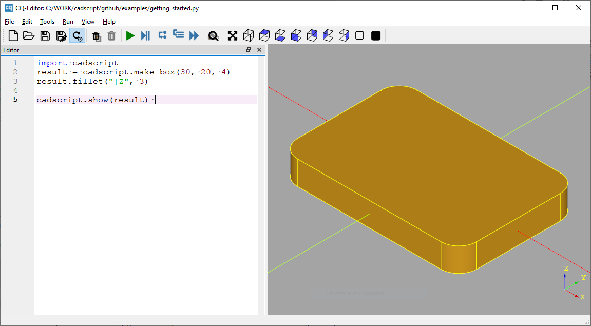
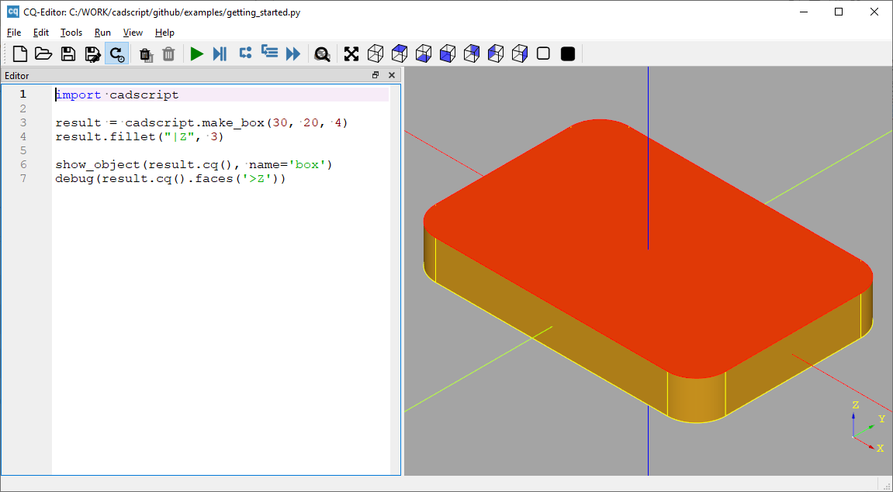

Installation
============

Cadscript is based on CadQuery, so the first step is to get CadQuery running. 
Please refer to their `installation guide <https://cadquery.readthedocs.io/en/latest/installation.html>`_.
The conda method worked well for us.

After that install the cadscript module using pip::

    pip install cadscript

CQ-Editor
---------

If you want an IDE that can preview 3D geometry, you can use `CQ-Editor <https://github.com/CadQuery/CQ-editor>`_.
When using its installer, you have to add cadscript to its Python installation. 
You can do this by copying the cadscript folder from your Python installation to the CQ-Editor installation folder.

Wheny you have done this, you can do the following in CQ-Editor::

    import cadscript

    result = cadscript.make_box(30, 20, 4)
    result.fillet("|Z", 3)

    cadscript.show(result) 

:py:meth:`cadscript.show` will regognize the CQ-Editor environment and show the geometry in the 3D view.

Alternatively you can use the standard CQ-Editor methods::

    import cadscript

    result = cadscript.make_box(30, 20, 4)
    result.fillet("|Z", 3)

    show_object(result.cq(), name='box')
    debug(result.cq().faces('>Z'))

`The CQ-Editor readme <https://github.com/CadQuery/CQ-editor>`_ lists all built-in methods for displaying and debugging 3d geometry.